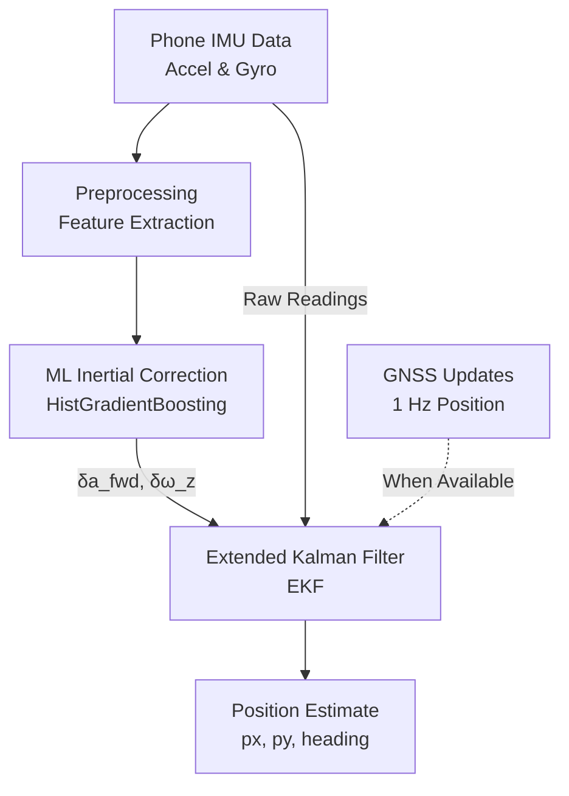

# SUMARO System Architecture

Welcome to the architectural overview of the **SUMARO** project! SUMARO stands for Smartphone-Based GNSS-Denied Dead-Reckoning Navigation for 2-wheelers. 

In simple terms, when you ride a motorcycle or scooter, sometimes the GPS (GNSS) signal drops out (e.g., in a tunnel or between tall buildings). SUMARO uses the sensors already built into a smartphone (accelerometer and gyroscope, collectively the IMU) alongside Machine Learning and a mathematical filter to guess where you are until the GPS comes back.

## System Overview

SUMARO relies on a hybrid architecture that combines classical state estimation (an Extended Kalman Filter, or EKF) with data-driven corrections (Machine Learning).

### Data Flow Diagram

## Component Descriptions

1. **Simulator**: Since we need ground truth to test our system, we have a synthetic data generator. It simulates a 2-wheeler's physics, a phone's tilted mount, sensor noise, bias, and GNSS outages.
2. **Preprocessing**: Takes raw IMU streams and extracts time-windowed features (like standard deviations, means, jerk, and centripetal acceleration) without looking into the future.
3. **ML Models**: We train a Machine Learning model (HistGradientBoostingRegressor) to predict the errors in our IMU sensors. Instead of predicting speed directly (which doesn't work well due to physics), it predicts inertial residuals.
4. **EKF (Extended Kalman Filter)**: The brain of the classical navigation. It takes the noisy IMU inputs, subtracts the errors predicted by the ML model, and physically integrates them over time to estimate position, velocity, and heading. It also elegantly merges GNSS data when available.
5. **Fusion**: The overarching logic that combines the EKF with ML and handles GNSS dropouts.

## File Map
Here is where you can find the implementation of these components:
*   `src/data/phone_imu_simulation.py`: Simulates the 2-wheeler and phone sensors.
*   `src/data/multi_run_generator.py`: Generates the datasets for training and testing.
*   `src/features/feature_extraction.py`: Preprocessing and feature engineering.
*   `src/models/train_inertial_corrector.py`: ML model training pipeline.
*   `src/models/ekf.py`: The Extended Kalman Filter math and implementation.
*   `src/evaluate/benchmark.py`: Benchmarks different methods against each other.

## Key Design Decisions

*   **Hybrid Approach over End-to-End Deep Learning**: Deep learning models that directly output position often fail to generalize to new paths. By keeping the classical physics-based EKF and only using ML to *correct* the sensor inputs, the system remains robust, interpretable, and computationally light enough for a smartphone.
*   **Targeting Residuals, not Speed**: We use ML to predict *accelerometer forward error* and *gyroscope yaw error*. Predicting absolute speed from IMU data is physically flawed due to Galilean invariance (a physics principle stating you cannot measure constant velocity from inside a closed system). 

## Recommended Pipeline
**EKF + ML Inertial Prediction Corrections**. 
This pipeline runs the EKF, corrects the IMU inputs using the ML model before the integration step, and relies on GNSS when available. *Note: Fusing ML-predicted absolute speed directly into the EKF (speed fusion) was tested but is NOT recommended, as it degrades performance.*

## Current State
The system is currently a **research prototype validated on synthetic data**. We are in the progress of building an adapter for the IO-VNBD real-world dataset to validate these findings on real motorcycle data.
